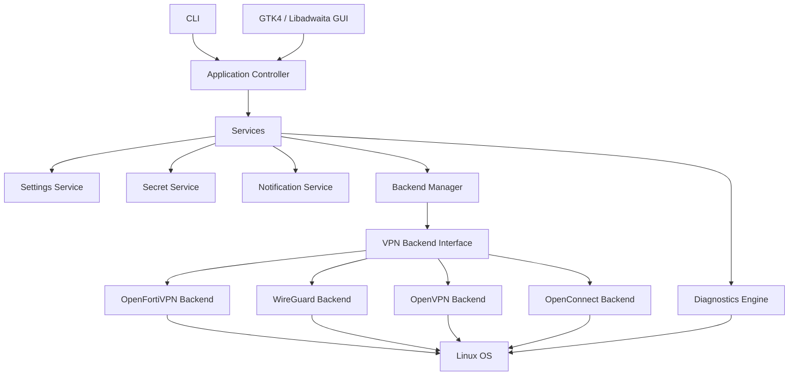

# Architecture

VPN Doctor is designed as a diagnostics-first VPN assistant.

The architecture must keep the GUI, the business logic, diagnostics and VPN backends
separated. This is essential because VPN Doctor should eventually support multiple
backends without rewriting the user interface.

## High-level architecture



## Dependency direction

Allowed:

```text
UI / CLI -> Controller -> Services -> Backends / Diagnostics -> OS
```

Forbidden:

```text
Backend -> UI
Diagnostics -> UI
Models -> Services
Models -> Backends
```

## Layer responsibilities

### CLI / UI

- Display information.
- Trigger actions.
- Render diagnostics.
- Never execute VPN binaries directly.
- Never parse backend logs directly.

### Controller

- Coordinates user actions.
- Calls services.
- Returns application-level results to CLI or GUI.

### Services

Services own business behaviour that is not specific to one backend.

Examples:

- settings loading;
- notification sending;
- secret retrieval;
- profile management;
- diagnostic orchestration.

### Diagnostics

Diagnostics should be backend-aware but not backend-owned.

A backend may expose backend-specific checks, but global checks such as DNS, routes,
MTU, process availability and interface status should live in diagnostics modules.

### Backends

A backend wraps one VPN engine.

Examples:

- `openfortivpn`;
- `wg`;
- `openvpn`;
- `openconnect`.

A backend is responsible for:

- command construction;
- process lifecycle;
- backend-specific log parsing;
- status normalization.

### Models

Models are data-only objects with no side effects.

Examples:

- `VPNProfile`;
- `VPNStatus`;
- `DiagnosticItem`;
- `DiagnosticReport`.

## Current code status

The current code includes:

- application bootstrap;
- controller;
- models;
- OpenFortiVPN backend skeleton;
- basic diagnostics;
- tests for models and command construction.

The next step is Sprint 2: designing and implementing a safe OpenFortiVPN process
lifecycle without leaking secrets and without coupling the backend to GTK.
