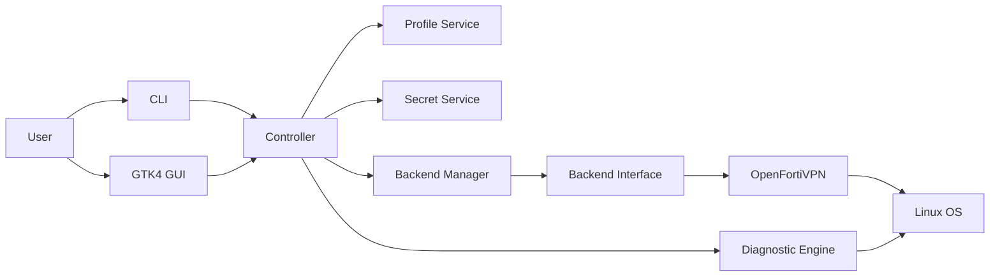
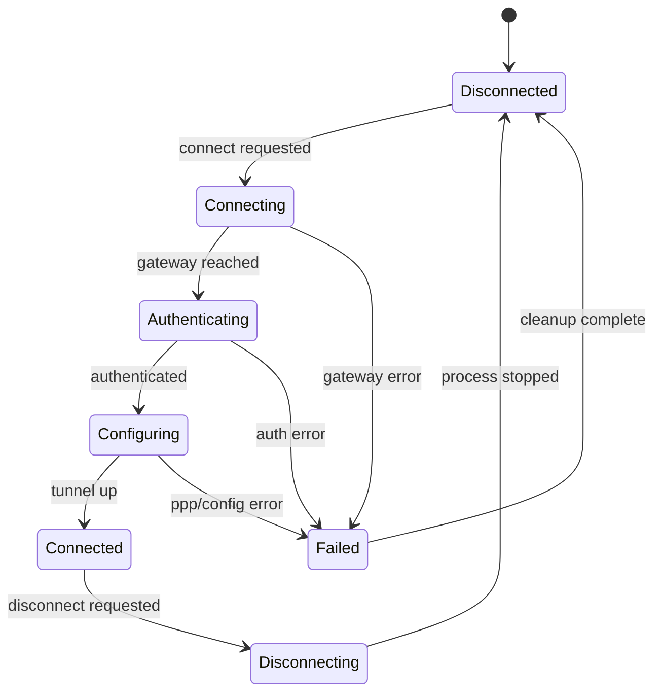
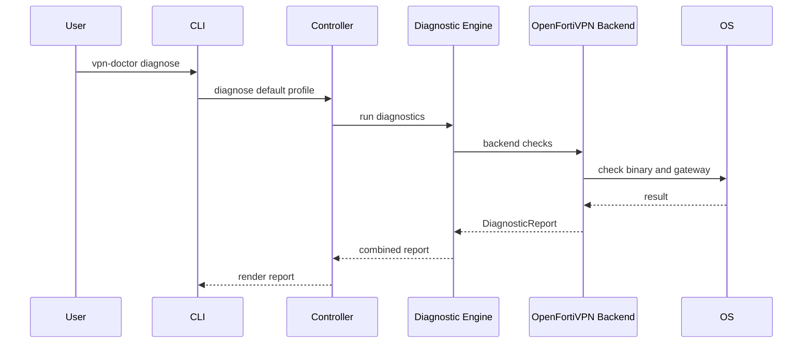

# Master Architecture

This document is the long-term technical reference for VPN Doctor.

## Product definition

VPN Doctor is a Linux desktop application and CLI tool that helps users connect to VPNs
and understand VPN failures.

It has three core verbs:

```text
Diagnose -> Connect -> Protect
```

## Architectural goals

VPN Doctor must be:

- backend-independent;
- safe with secrets;
- explainable;
- testable;
- desktop-friendly;
- distribution-friendly.

## System overview



## Package responsibilities

### `vpn_doctor.core`

Application orchestration.

Expected modules:

- `application.py`
- `controller.py`
- `events.py`

### `vpn_doctor.models`

Pure data models.

Rules:

- no subprocess;
- no filesystem writes;
- no network calls;
- no GTK imports.

### `vpn_doctor.services`

Application services.

Expected services:

- profile service;
- settings service;
- notification service;
- secret service;
- logging service.

### `vpn_doctor.backend`

Backend abstractions and concrete VPN engines.

The backend package must never import GTK.

### `vpn_doctor.diagnostics`

Global checks and diagnostic orchestration.

The diagnostics engine should be able to check:

- gateway reachability;
- DNS;
- routes;
- interfaces;
- MTU;
- certificates;
- required binaries;
- backend status.

### `vpn_doctor.ui`

GTK4 / Libadwaita UI.

The UI calls the controller and subscribes to status/log events.

## Backend lifecycle



## Diagnostic lifecycle



## Error handling philosophy

Every error should become a diagnostic object whenever possible.

Bad:

```text
Connection failed.
```

Good:

```text
Gateway reachable, authentication succeeded, PPP tunnel up, but no replies returned.
Possible causes: FortiGate policy, route mismatch, backend plugin issue.
```

## Security boundaries

Profiles may contain:

- backend name;
- gateway host;
- port;
- username;
- realm;
- trusted certificate fingerprint.

Profiles must not contain:

- VPN password;
- MFA token;
- private key material.

Secrets belong in Secret Service / GNOME Keyring.

## What must remain flexible

The project must not hard-code itself around OpenFortiVPN. OpenFortiVPN is only the
first backend. The architecture must allow WireGuard, OpenVPN and OpenConnect later.
