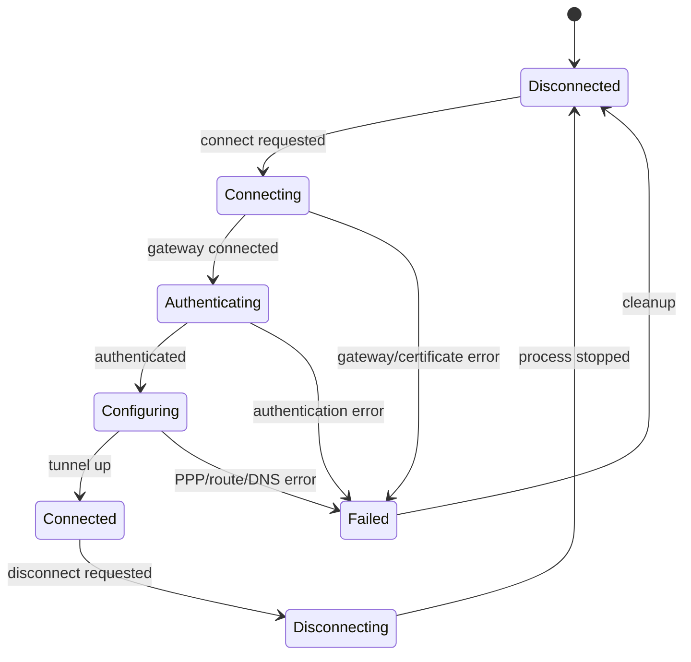

# OpenFortiVPN Backend Design

Sprint 2 introduces the backend design for `openfortivpn`.

## Scope

Sprint 2 should implement a safe backend lifecycle skeleton:

- validate that `openfortivpn` exists;
- build commands without embedding secrets;
- start a process later through a service layer;
- parse important log lines;
- expose normalized connection states;
- keep the GUI independent from `subprocess`.

Actual secure password storage belongs to a later sprint.

## Connection lifecycle

## Expected log mapping

| openfortivpn log fragment | Normalized meaning |
| --- | --- |
| `Connected to gateway` | gateway reached |
| `Authenticated` | authentication succeeded |
| `Remote gateway has allocated a VPN` | VPN configuration received |
| `Tunnel is up and running` | connected |
| `Gateway certificate validation failed` | certificate rejected |
| `Could not authenticate` | authentication failed |
| `pppd` / `link was terminated` | PPP problem or disconnected |

## Command construction rules

Allowed command parts:

- binary path;
- host and port;
- username;
- trusted certificate fingerprint;
- optional realm if supported later.

Forbidden:

- password in command line;
- password in logs;
- customer-specific values in committed code.

## Security note

Passing passwords on stdin is acceptable only as an intermediate implementation detail.
The long-term design must use Secret Service / GNOME Keyring and avoid logging stdin.

## Sprint 2 acceptance criteria

- Backend exposes a stable Python API.
- Backend can run basic diagnostics without root.
- Backend can parse sample logs into events/statuses.
- Tests cover log parsing and command building.
- No real VPN credentials are committed.
