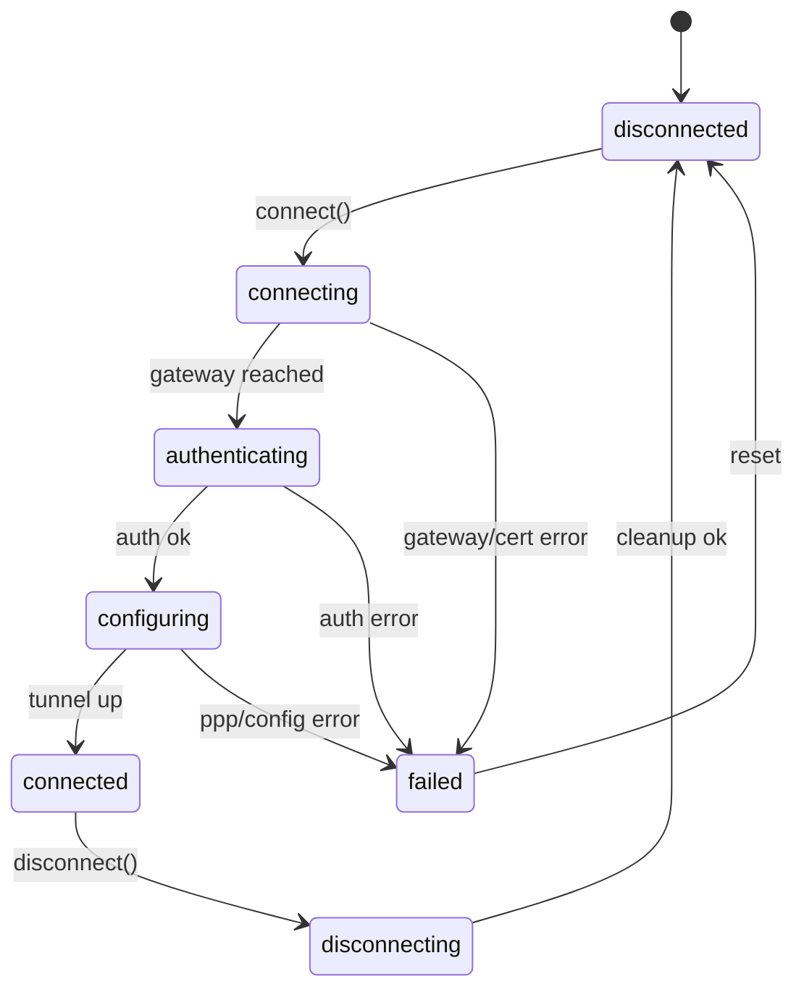

# VPN Connection State Machine

## States

```text
disconnected
connecting
authenticating
configuring
connected
disconnecting
failed
unknown
```

## State transitions



## Notes

Not every backend exposes all intermediate states. VPN Doctor should normalize best-effort
signals while preserving raw backend logs for troubleshooting.
