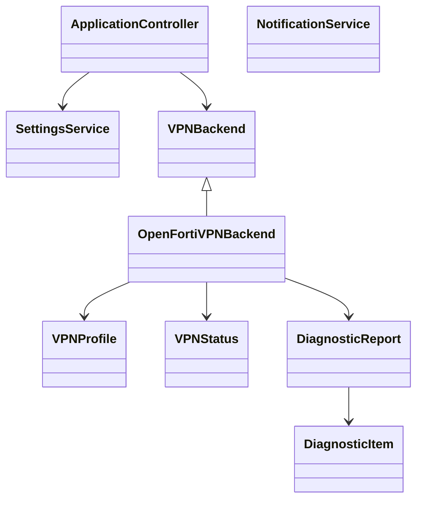
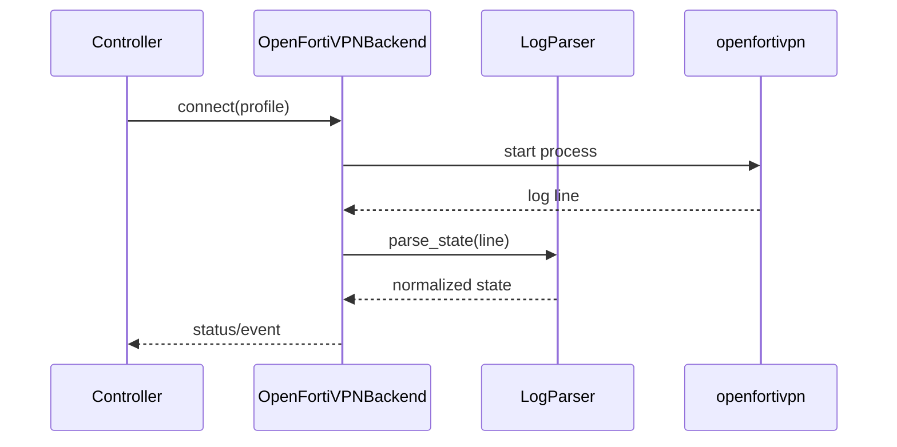

# UML and Mermaid Diagrams

## Main layers

```mermaid
classDiagram
    class ApplicationController
    class SettingsService
    class NotificationService
    class VPNBackend
    class OpenFortiVPNBackend
    class VPNProfile
    class VPNStatus
    class DiagnosticReport
    class DiagnosticItem

    ApplicationController --> SettingsService
    ApplicationController --> VPNBackend
    VPNBackend <|-- OpenFortiVPNBackend
    OpenFortiVPNBackend --> VPNProfile
    OpenFortiVPNBackend --> VPNStatus
    OpenFortiVPNBackend --> DiagnosticReport
    DiagnosticReport --> DiagnosticItem
```

## Backend sequence

```mermaid
sequenceDiagram
    participant Controller
    participant Backend as OpenFortiVPNBackend
    participant Parser as LogParser
    participant Process as openfortivpn

    Controller->>Backend: connect(profile)
    Backend->>Process: start process
    Process-->>Backend: log line
    Backend->>Parser: parse_state(line)
    Parser-->>Backend: normalized state
    Backend-->>Controller: status/event
```
